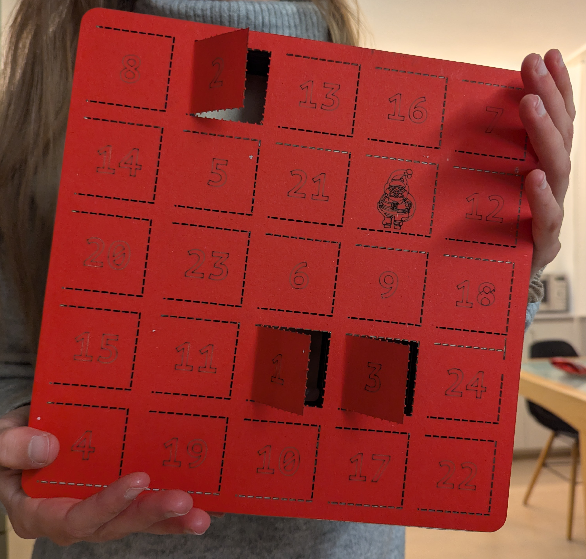
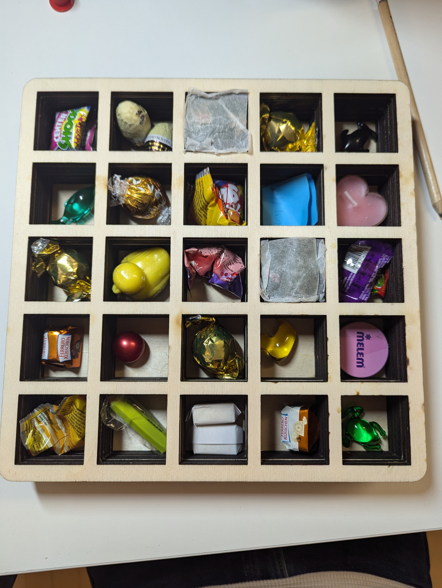

# DIY Wooden Advent Calendar 🎄✨🎁

This repository contains blueprints for a DIY advent calendar using a laser cutter.

The designs were created in Inkscape. Original files are saved in SVG format, while files for cutting are exported in DXF format.

## Instructions
1. **Cut the following parts:**
    - 1x wooden `base` (thin wood, 2-3 mm is sufficient).
    - Multiple middle parts: `middle` (I cut 6 middle plates of 4 mm thickness each).
    - 1x cardstock `adventni_top_small`. On the laser cutter, set the graphics to cutting mode (as high speed and low power as possible, if you cutter even allows for this). This makes for a faster production and looks cleaner in my opinion.
2. Sand and clean all layers.
3. Glue the wooden layers together.
4. Fill the calendar with small gifts.
5. Glue the cardstock layer to the wooden layers.

## Notes:
- The top layer (paper) is slightly misaligned and needs to be redrawn.
- Instead of using dashed paths in Inkscape, consider using the laser's dashed line feature to speed up the cutting process.
